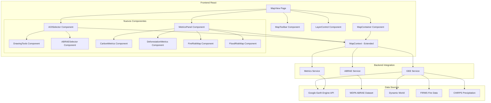

# Plan de Refactorización: Sección de Mapas con Google Earth Engine

## 🎯 Objetivo

Refactorizar la sección de mapas para integrar funcionalidades avanzadas de Google Earth Engine (GEE), permitiendo:
1. Selección de AOI (Área de Interés) mediante dibujo o selector de ABRAE
2. Panel de control con métricas ambientales
3. Visualización de cobertura arbórea, deforestación, riesgos de incendios e inundaciones

---

## 📊 Análisis de la Situación Actual

### Componentes Existentes

#### [`src/components/map/MapContainer.tsx`](../src/components/map/MapContainer.tsx)
- Utiliza Leaflet para renderizar el mapa
- Muestra marcadores de amenazas (threats)
- Maneja popups con información de amenazas
- Centro: Venezuela (6.5°N, -62.5°W), Zoom: 8

#### [`src/components/map/MapToolbar.tsx`](../src/components/map/MapToolbar.tsx)
- Controles de zoom
- Búsqueda de ubicaciones
- Herramientas de medición (distancia y área)

#### [`src/components/map/LayerControl.tsx`](../src/components/map/LayerControl.tsx)
- Control de visibilidad y opacidad de capas
- Capas actuales: Amenazas, NDVI, Cuerpos de agua, Áreas protegidas, Comunidades

#### [`src/contexts/MapContext.tsx`](../src/contexts/MapContext.tsx)
- Estado global del mapa: centro, zoom, capas
- No tiene soporte para AOI ni integración con GEE

### Scripts de Google Earth Engine

#### [`gee/alertas.js`](../gee/alertas.js)
- Sistema de monitoreo ambiental para ABRAE de Venezuela
- Módulos: Carbono, Deforestación (5%), Inundación (AHP), Incendios (FIRMS)
- Selector de ABRAE por tipo y nombre
- Análisis satelital con Dynamic World y Sentinel-2
- **Limitación**: Diseñado para Earth Engine Code Editor, no para web

#### [`gee/LULC.js`](../gee/LULC.js)
- Monitor forestal con análisis de carbono y deforestación
- Predicción de cambios futuros con Random Forest
- Herramientas de dibujo y selección de ABRAE
- Animación timelapse de cobertura del suelo
- **Limitación**: Interfaz nativa de GEE, no exportable directamente

---

## 🏗️ Arquitectura Propuesta



---

## 🔧 Plan de Implementación Detallado

### **Fase 1: Extensión del MapContext** 
**Archivos afectados**: [`src/contexts/MapContext.tsx`](../src/contexts/MapContext.tsx)

#### Nuevas propiedades del contexto:
```typescript
interface MapContextType {
  // Existentes...
  layers: MapLayer[];
  toggleLayer: (layerId: string) => void;
  setLayerOpacity: (layerId: string, opacity: number) => void;
  selectedThreatId: string | null;
  setSelectedThreatId: (id: string | null) => void;
  mapCenter: [number, number];
  setMapCenter: (center: [number, number]) => void;
  mapZoom: number;
  setMapZoom: (zoom: number) => void;
  
  // NUEVAS
  aoi: AOI | null;
  setAOI: (aoi: AOI | null) => void;
  aoiSelectionMode: 'draw' | 'abrae' | null;
  setAOISelectionMode: (mode: 'draw' | 'abrae' | null) => void;
  drawnGeometry: any | null;
  setDrawnGeometry: (geometry: any) => void;
  selectedABRAE: ABRAE | null;
  setSelectedABRAE: (abrae: ABRAE | null) => void;
  environmentalMetrics: EnvironmentalMetrics | null;
  setEnvironmentalMetrics: (metrics: EnvironmentalMetrics | null) => void;
  isLoadingMetrics: boolean;
  setIsLoadingMetrics: (loading: boolean) => void;
}
```

#### Tipos nuevos a definir en [`src/types/index.ts`](../src/types/index.ts):
```typescript
export interface AOI {
  id: string;
  type: 'drawn' | 'abrae';
  geometry: GeoJSON.Geometry;
  name?: string;
  area?: number; // hectáreas
}

export interface ABRAE {
  id: string;
  name: string;
  type: string; // DESIG del WDPA
  geometry: GeoJSON.Geometry;
}

export interface EnvironmentalMetrics {
  areaTotal: number; // hectáreas
  coberturaBoscosa: {
    area: number; // hectáreas
    porcentaje: number; // %
  };
  deforestacion: {
    areaTotal: number; // hectáreas
    porcentaje: number; // %
    anual: Array<{ year: number; area: number }>;
    causas: Array<{ tipo: string; area: number }>;
  };
  carbono: {
    stockTotal: number; // toneladas C
    co2Equivalente: number; // toneladas CO2e
    valorUSD: number;
  };
  riesgoIncendio: {
    nivel: 'bajo' | 'medio' | 'alto';
    focosActivos: number;
  };
  riesgoInundacion: {
    nivel: 'bajo' | 'medio' | 'alto';
    areaAfectada: number; // hectáreas
  };
  ultimaActualizacion: string;
}
```

---

### **Fase 2: Componente AOISelector**
**Nuevo archivo**: `src/components/map/AOISelector.tsx`

Contendrá tabs para alternar entre:
- **Dibujar en el mapa**: Botones para activar herramientas de dibujo (polígono, rectángulo, círculo)
- **Seleccionar ABRAE**: Selectores desplegables (tipo y nombre)

#### Estructura visual:
```
┌─────────────────────────────────────┐
│ Selección de Área de Interés (AOI) │
├─────────────────────────────────────┤
│ [Dibujar] [ABRAE]                   │  ← Tabs
├─────────────────────────────────────┤
│ ▢ Polígono  □ Rectángulo  ○ Círculo│  ← Si tab "Dibujar"
│                                     │
│ Tipo: [Parque Nacional ▼]          │  ← Si tab "ABRAE"
│ Nombre: [Canaima ▼]                │
│                                     │
│ [Limpiar AOI] [Calcular Métricas]  │
└─────────────────────────────────────┘
```

---

### **Fase 3: Herramientas de Dibujo con Leaflet**
**Integración**: [Leaflet.Draw](https://leaflet.github.io/Leaflet.draw/docs/leaflet-draw-latest.html) o [React-Leaflet-Draw](https://github.com/alex3165/react-leaflet-draw)

**Nuevo archivo**: `src/components/map/DrawingTools.tsx`

Funcionalidades:
- Dibujar polígonos, rectángulos, círculos
- Editar geometrías dibujadas
- Eliminar geometrías
- Guardar en el MapContext como `drawnGeometry`

---

### **Fase 4: ABRAESelector Component**
**Nuevo archivo**: `src/components/map/ABRAESelector.tsx`

Consumirá un servicio que obtenga ABRAE de Venezuela desde:
- **Opción A**: API local que haga proxy a Google Earth Engine
- **Opción B**: Dataset WDPA precargado en Supabase
- **Opción C**: GeoJSON estático con ABRAE de Venezuela

```typescript
interface ABRAESelectorProps {
  onSelect: (abrae: ABRAE) => void;
}
```

Lógica:
1. Al montar, cargar tipos únicos de ABRAE
2. Al seleccionar tipo, cargar nombres disponibles
3. Al seleccionar nombre, obtener geometría y llamar `onSelect`

---

### **Fase 5: MetricsPanel Component**
**Nuevo archivo**: `src/components/map/MetricsPanel.tsx`

Panel ubicado **debajo del mapa** (no lateral) con:

```
┌────────────────────────────────────────────────────────────┐
│                   MÉTRICAS AMBIENTALES                     │
├────────────────────────────────────────────────────────────┤
│ ┌──────────────┐ ┌──────────────┐ ┌──────────────┐       │
│ │ Cobertura    │ │ Deforestación│ │ Carbono      │       │
│ │ Arbórea      │ │              │ │ Almacenado   │       │
│ │ 45,230 ha    │ │ 1,250 ha     │ │ 120,500 tC   │       │
│ │ (65%)        │ │ (-5.2%)      │ │ $602,500 USD │       │
│ └──────────────┘ └──────────────┘ └──────────────┘       │
├────────────────────────────────────────────────────────────┤
│ ┌─────────────────────────┐ ┌─────────────────────────┐  │
│ │ Riesgo de Incendios     │ │ Riesgo de Inundaciones │  │
│ │ [Mapa de calor]         │ │ [Mapa de calor]        │  │
│ │ Nivel: Alto 🔥          │ │ Nivel: Medio 💧        │  │
│ │ Focos activos: 12       │ │ Área afectada: 2,340 ha│  │
│ └─────────────────────────┘ └─────────────────────────┘  │
└────────────────────────────────────────────────────────────┘
```

Estructura de componentes:
```
MetricsPanel
├── MetricsSummary (KPIs superiores)
│   ├── CarbonMetricCard
│   ├── DeforestationMetricCard
│   └── ForestCoverMetricCard
└── RiskMapsGrid
    ├── FireRiskMap
    └── FloodRiskMap
```

---

### **Fase 6: Servicios de Backend/API**

#### **Opción A: Google Earth Engine Python API + Cloud Functions**
Ventaja: Acceso directo a GEE, procesamiento en servidor  
Desventaja: Requiere infraestructura adicional

#### **Opción B: Earth Engine Apps (Código embebido)**
Ventaja: No requiere backend propio  
Desventaja: Limitaciones en personalización

#### **Opción C: Tiles/GeoJSON Pre-computados**
Ventaja: Rendimiento rápido, sin procesamiento en tiempo real  
Desventaja: Datos estáticos, actualizaciones manuales

**Recomendación**: **Opción A** para mayor flexibilidad

#### Servicio GEE propuesto
**Nuevo archivo**: `src/services/geeService.ts`

```typescript
export const geeService = {
  async getEnvironmentalMetrics(aoi: GeoJSON.Geometry): Promise<EnvironmentalMetrics> {
    // Llamada a Cloud Function o API que ejecute:
    // - Dynamic World LULC
    // - Hansen Forest Cover Loss
    // - FIRMS fire data
    // - CHIRPS rainfall + topography para inundación
    // - Cálculo de carbono (stock por clase LULC)
  },
  
  async getABRAEList(): Promise<ABRAE[]> {
    // Obtener lista de ABRAE de Venezuela desde WDPA
  },
  
  async getABRAEGeometry(name: string, type: string): Promise<GeoJSON.Geometry> {
    // Obtener geometría específica de un ABRAE
  },
  
  async getFireRiskLayer(aoi: GeoJSON.Geometry): Promise<TileLayer | GeoJSON> {
    // Retornar capa de riesgo de incendios
  },
  
  async getFloodRiskLayer(aoi: GeoJSON.Geometry): Promise<TileLayer | GeoJSON> {
    // Retornar capa de riesgo de inundaciones
  }
};
```

---

### **Fase 7: Integración de Capas de Riesgo**

#### Nuevas capas en [`src/contexts/MapContext.tsx`](../src/contexts/MapContext.tsx):
```typescript
const environmentalLayers: MapLayer[] = [
  {
    id: 'forest-cover',
    name: 'Cobertura Forestal (Dynamic World)',
    type: 'FOREST_COVER',
    visible: false,
    opacity: 0.7,
  },
  {
    id: 'deforestation',
    name: 'Deforestación (Hansen/Dynamic World)',
    type: 'DEFORESTATION',
    visible: false,
    opacity: 0.8,
  },
  {
    id: 'fire-risk',
    name: 'Riesgo de Incendios (FIRMS + NDWI)',
    type: 'FIRE_RISK',
    visible: false,
    opacity: 0.6,
  },
  {
    id: 'flood-risk',
    name: 'Riesgo de Inundaciones (AHP)',
    type: 'FLOOD_RISK',
    visible: false,
    opacity: 0.6,
  },
];
```

#### Renderizado de capas en [`src/components/map/MapContainer.tsx`](../src/components/map/MapContainer.tsx):
```typescript
// Después de TileLayer base y marcadores de amenazas:
{layers.find(l => l.id === 'forest-cover' && l.visible) && (
  <GeoJSON
    data={forestCoverData}
    style={{ fillColor: '#397D49', fillOpacity: 0.7 }}
  />
)}

{layers.find(l => l.id === 'fire-risk' && l.visible) && (
  <HeatmapLayer
    points={fireRiskPoints}
    longitudeExtractor={p => p[1]}
    latitudeExtractor={p => p[0]}
    intensityExtractor={p => p[2]}
  />
)}
```

---

### **Fase 8: Layout Responsivo de MapView**
**Archivo modificado**: [`src/pages/MapView.tsx`](../src/pages/MapView.tsx)

```tsx
<div className="container mx-auto p-6 space-y-6">
  {/* Header */}
  <div>...</div>
  
  {/* AOI Selector */}
  <AOISelector />
  
  {/* Mapa y controles laterales */}
  <div className="grid grid-cols-1 lg:grid-cols-4 gap-6">
    <div className="lg:col-span-1 space-y-4">
      <LayerControl />
    </div>
    <div className="lg:col-span-3">
      <MapToolbar />
      <MapContainerComponent />
    </div>
  </div>
  
  {/* Panel de métricas DEBAJO del mapa */}
  <MetricsPanel />
</div>
```

---

## 📦 Dependencias Adicionales

```json
{
  "dependencies": {
    "leaflet-draw": "^1.0.4",
    "react-leaflet-draw": "^0.20.4",
    "@turf/turf": "^6.5.0",
    "geojson": "^0.5.0"
  }
}
```

---

## 🚀 Orden de Implementación

### Sprint 1: Fundamentos (Fase 1-3)
1. ✅ Extender [`MapContext.tsx`](../src/contexts/MapContext.tsx) con tipos nuevos
2. ✅ Actualizar [`src/types/index.ts`](../src/types/index.ts) con interfaces AOI, ABRAE, EnvironmentalMetrics
3. ✅ Crear [`AOISelector.tsx`](../src/components/map/AOISelector.tsx) con estructura de tabs
4. ✅ Implementar [`DrawingTools.tsx`](../src/components/map/DrawingTools.tsx) con Leaflet.Draw

### Sprint 2: Selección de ABRAE (Fase 4)
5. ✅ Crear [`ABRAESelector.tsx`](../src/components/map/ABRAESelector.tsx)
6. ✅ Implementar [`abraeService.ts`](../src/services/abraeService.ts) (dataset WDPA)
7. ✅ Integrar selector en [`AOISelector.tsx`](../src/components/map/AOISelector.tsx)

### Sprint 3: Métricas y Visualización (Fase 5-7)
8. ✅ Crear estructura de [`MetricsPanel.tsx`](../src/components/map/MetricsPanel.tsx)
9. ✅ Implementar componentes individuales de métricas
10. ✅ Crear [`geeService.ts`](../src/services/geeService.ts) con endpoints simulados
11. ✅ Integrar capas de riesgo en [`MapContainer.tsx`](../src/components/map/MapContainer.tsx)
12. ✅ Añadir capas ambientales a [`LayerControl.tsx`](../src/components/map/LayerControl.tsx)

### Sprint 4: Integración y Pulido (Fase 8)
13. ✅ Reorganizar layout en [`MapView.tsx`](../src/pages/MapView.tsx)
14. ✅ Conectar flujo completo: AOI → Servicio GEE → Métricas → Visualización
15. ✅ Implementar estados de carga y manejo de errores
16. ✅ Testing y ajustes de UI/UX

---

## ⚠️ Desafíos Técnicos

### 1. **Google Earth Engine en Frontend**
**Problema**: GEE está diseñado para ejecutarse en el Code Editor o backend (Python)  
**Solución**: 
- Backend con Cloud Functions/Firebase que ejecute scripts GEE
- O usar Earth Engine Apps embebidas (limitado)
- O pre-computar datos y servir via API REST

### 2. **Volumen de Datos**
**Problema**: Imágenes satelitales y análisis pueden ser pesados  
**Solución**:
- Usar tiles (XYZ) en lugar de GeoJSON para rasters
- Limitar AOI a tamaños razonables (máx 100,000 ha)
- Implementar cache en servidor

### 3. **Sincronización de Estado**
**Problema**: Estado del mapa distribuido entre múltiples componentes  
**Solución**:
- Centralizar en MapContext
- Usar React Query para cache de datos GEE
- Implementar loading states claros

### 4. **Rendimiento de Dibujo**
**Problema**: Leaflet.Draw puede ser lento con polígonos complejos  
**Solución**:
- Simplificar geometrías con Turf.js antes de enviar al servidor
- Limitar número de vértices

---

## 📝 Notas de Migración desde GEE

### De `alertas.js`:
- ✅ Selector de ABRAE (tipo y nombre)
- ✅ Cálculo de carbono con Dynamic World
- ✅ Detección de deforestación (5%)
- ✅ Riesgo de inundación (AHP con MERIT Hydro)
- ✅ Incendios activos (FIRMS)
- ✅ Generación de KPIs (carbono, deforestación, coordenadas)

### De `LULC.js`:
- ✅ Herramientas de dibujo
- ✅ Análisis de cobertura del suelo (LULC)
- ✅ Deforestación secuencial anual
- ✅ Predicción futura (Random Forest) - OPCIONAL
- ✅ Timelapse de cobertura - OPCIONAL
- ✅ Gráficos de distribución de clases

---

## 🎨 Diseño Visual

### Paleta de Colores para Mapas de Riesgo

**Riesgo de Incendios**:
```css
--fire-low: #FFFFB2
--fire-medium: #FD8D3C
--fire-high: #BD0026
```

**Riesgo de Inundaciones**:
```css
--flood-low: #EFF3FF
--flood-medium-low: #BDD7E7
--flood-medium: #6BAED6
--flood-medium-high: #3182BD
--flood-high: #08519C
```

**Cobertura del Suelo (Dynamic World)**:
```css
--dw-water: #419BDF
--dw-trees: #397D49
--dw-grass: #88B053
--dw-flooded-veg: #7A87C6
--dw-crops: #E49635
--dw-shrub: #DFC35A
--dw-built: #C82828
--dw-bare: #A59B8B
```

---

## 🔍 Testing

### Casos de Prueba
1. ✅ Dibujar polígono → Calcular métricas → Verificar resultados
2. ✅ Seleccionar ABRAE "Parque Nacional Canaima" → Visualizar en mapa
3. ✅ Activar capa de riesgo de incendios → Ver sobre el mapa
4. ✅ Cambiar AOI → Actualizar métricas automáticamente
5. ✅ Probar con AOI muy grande (>100k ha) → Manejo de error/warning
6. ✅ Probar con AOI sin bosque → Métricas en cero sin errores

---

## 📚 Referencias

- [Google Earth Engine Guides](https://developers.google.com/earth-engine/guides)
- [Dynamic World Dataset](https://developers.google.com/earth-engine/datasets/catalog/GOOGLE_DYNAMICWORLD_V1)
- [WDPA Protected Areas](https://developers.google.com/earth-engine/datasets/catalog/WCMC_WDPA_current_polygons)
- [FIRMS Fire Data](https://firms.modaps.eosdis.nasa.gov/)
- [Leaflet.Draw Documentation](https://leaflet.github.io/Leaflet.draw/docs/leaflet-draw-latest.html)
- [Turf.js Spatial Analysis](https://turfjs.org/)

---

## ✅ Checklist de Implementación

- [ ] Fase 1: MapContext extendido
- [ ] Fase 2: AOISelector component
- [ ] Fase 3: DrawingTools con Leaflet.Draw
- [ ] Fase 4: ABRAESelector con servicio WDPA
- [ ] Fase 5: MetricsPanel y sub-componentes
- [ ] Fase 6: geeService.ts con API backend
- [ ] Fase 7: Capas de riesgo integradas al mapa
- [ ] Fase 8: Layout final en MapView
- [ ] Testing completo
- [ ] Documentación de usuario

---

**Última actualización**: 2026-01-02  
**Responsable**: Denny Javier Rosales  
**Proyecto**: GEO-MONITOR VENEZUELA - Sistema de Monitoreo Ambiental ABRAE
